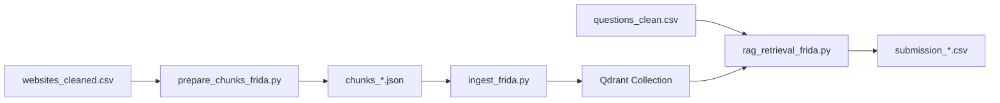

# 📂 Структура проекта

```
rag_xakaton_final/
│
├── 📄 README.md                    # Полная документация
├── 📄 QUICKSTART.md                # Быстрый старт
├── 📄 STRUCTURE.md                 # Этот файл - описание структуры
│
├── ⚙️ .env                          # Переменные окружения (настройки)
├── ⚙️ .gitignore                    # Игнорируемые файлы для Git
├── ⚙️ docker-compose.yml            # Конфигурация Docker (Qdrant)
├── ⚙️ requirements.txt              # Aайл зависимостей
│
├── 📁 src/                         # Исходный код
│   ├── __init__.py                 # Python package init
│   ├── config.py                   # Конфигурация приложения
│   ├── prepare_chunks_frida.py     # Подготовка чанков (500 токенов)
│   ├── ingest_frida.py             # Создание эмбеддингов + Qdrant
│   └── rag_retrieval_frida.py      # Поиск и создание submission
│
├── 📁 data/                        # Данные
│   ├── README.md                   # Описание структуры данных
│   ├── websites_cleaned.csv        # ← Поместите сюда ваши документы
│   ├── questions_clean.csv         # ← Поместите сюда ваши вопросы
│   └── rag_collection/             # Генерируется автоматически
│       └── chunks_*.json           # JSON файлы с чанками
│
├── 📁 submissions/                 # Результаты поиска (создается автоматически)
│   └── submission_*.csv            # Файлы с результатами
│
├── 📁 qdrant/                      # Хранилище Qdrant
│   └── storage/                    # Векторная БД (создается автоматически)
│       └── .gitkeep
│
└── 📁 .venv/                       # Виртуальное окружение (создается при установке)

```

## 🎯 Ключевые файлы

### Основные скрипты

| Файл | Назначение | Команда |
|------|-----------|---------|
| `prepare_chunks_frida.py` | Разбивает документы на чанки | `python -m src.prepare_chunks_frida --chunk-size 500 --overlap 100 --output chunks.json` |
| `ingest_frida.py` | Создает эмбеддинги и загружает в Qdrant | `python -m src.ingest_frida --input chunks.json --collection name` |
| `rag_retrieval_frida.py` | Выполняет поиск и создает submission | `python -m src.rag_retrieval_frida --collection name` |

### Конфигурация

| Файл | Назначение |
|------|-----------|
| `.env` | Переменные окружения (токены, порты, пути) |
| `config.py` | Python конфигурация (пути, модели, параметры) |
| `docker-compose.yml` | Настройки Qdrant контейнера |

### Документация

| Файл | Назначение |
|------|-----------|
| `README.md` | Полная документация с установкой и troubleshooting |
| `QUICKSTART.md` | Минимальная инструкция для быстрого старта |
| `STRUCTURE.md` | Описание структуры проекта (этот файл) |

## 🔄 Процесс работы



1. **Подготовка данных** → `prepare_chunks_frida.py` разбивает документы на чанки
2. **Индексация** → `ingest_frida.py` создает эмбеддинги и загружает в Qdrant
3. **Поиск** → `rag_retrieval_frida.py` находит релевантные документы для вопросов

## 📦 Размеры файлов (примерно)

| Компонент | Размер |
|-----------|--------|
| Исходные документы | ~50-100 MB |
| Чанки (JSON) | ~100-200 MB |
| Qdrant коллекция | ~2-3 GB |
| Модель FRIDA (кэш) | ~3 GB |
| **Всего на диске** | **~5-7 GB** |

## 🚀 Автоматический запуск

Используйте готовые скрипты для автоматического выполнения всего пайплайна:

**Linux/macOS:**
```bash
./run_full_pipeline.sh 500 100
```

**Windows:**
```cmd
run_full_pipeline.bat 500 100
```

Аргументы:
1. Размер чанка в токенах (по умолчанию: 500)
2. Overlap в токенах (по умолчанию: 100)

## 📝 Примечания

- Все пути относительны к корню проекта
- Папки `submissions/` и `data/rag_collection/` создаются автоматически
- Файлы `.csv` в `data/` нужно добавить вручную (не включены в репозиторий)
- Папка `qdrant/storage/` содержит данные векторной БД


